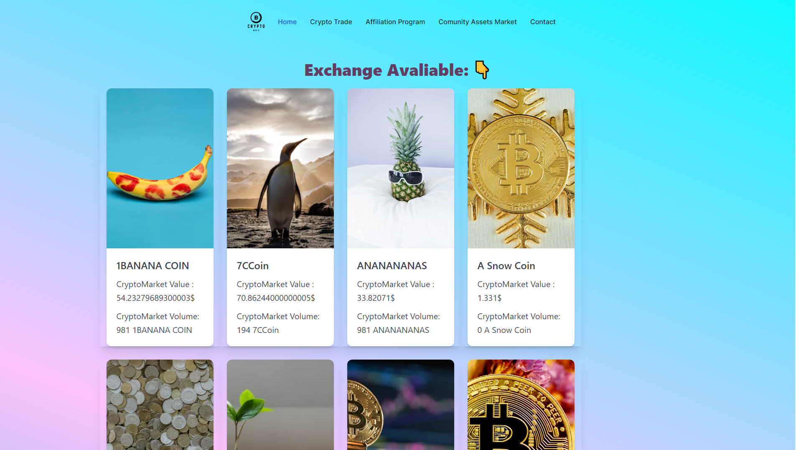

# Crypto Exchange 🤝




# Exchange Platform

## Overview

Exchange Platform is a web application that allows users to create and trade cryptocurrency offers. Users can list their cryptocurrency for sale and trade with other users. The platform provides a seamless user experience for managing crypto trades efficiently.

## Features

- Create a new cryptocurrency offer
- View and trade existing cryptocurrency offers
- User authentication and authorization
- Responsive design for mobile and desktop

## Technologies Used

- React
- TypeScript
- Next.js
- Axios
- CSS (with TailwindCSS for styling)
- 
## Getting Started

To run the application locally, follow these steps:

- pnpm i ||  npm i
- npm run dev

### Prerequisites

Ensure you have the following installed on your local development environment:

- Node.js (>=14.x.x)
- npm (>=6.x.x) or yarn (>=1.x.x)

### Installation

1. Clone the repository:

    ```bash
    git clone https://github.com/yourusername/exchange-platform.git
    cd exchange-platform
    ```

2. Install the dependencies:

    ```bash
    npm install
    ```

    or

    ```bash
    yarn install
    ```

### Environment Variables

Create a `.env.local` file in the root directory and add the following environment variables:

```plaintext
NEXT_PUBLIC_API_URL=http://your-api-url
